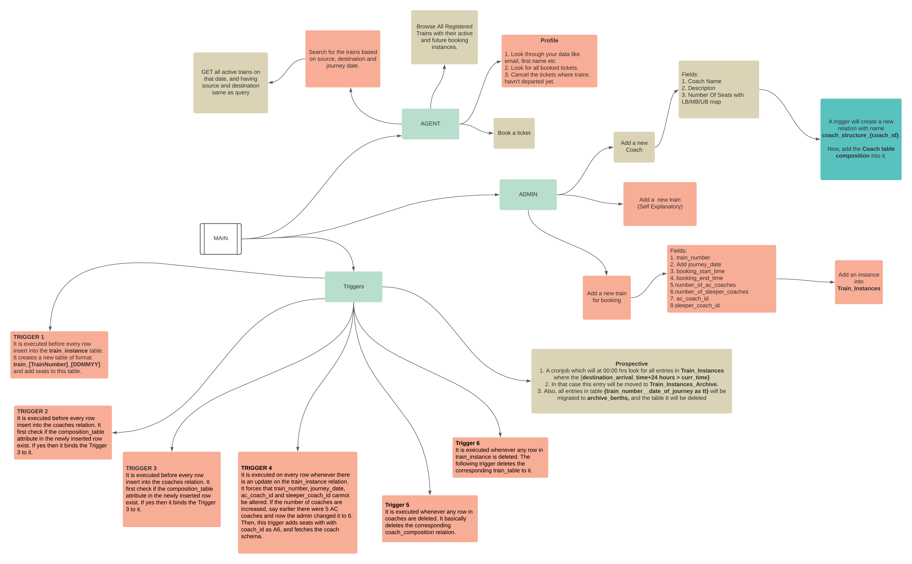
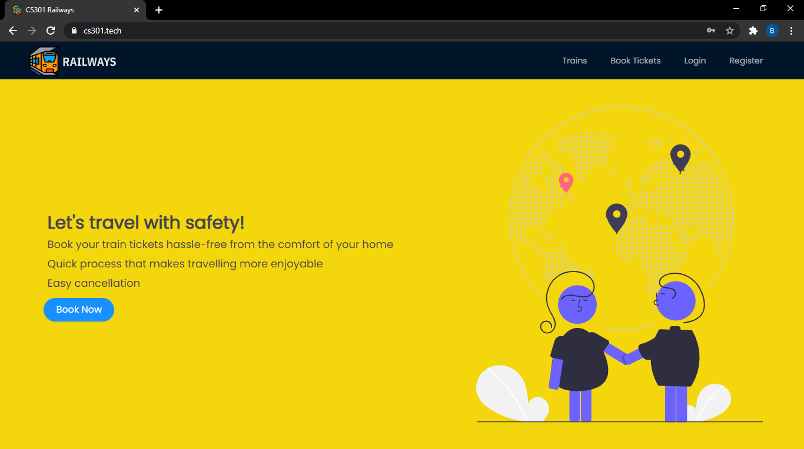
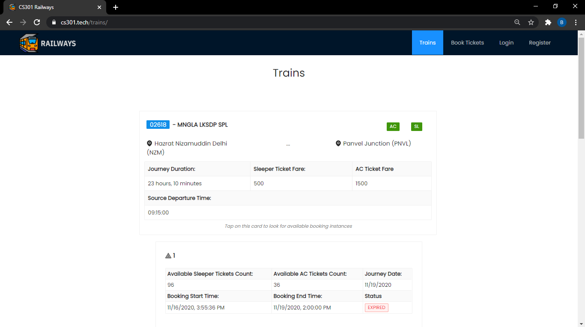
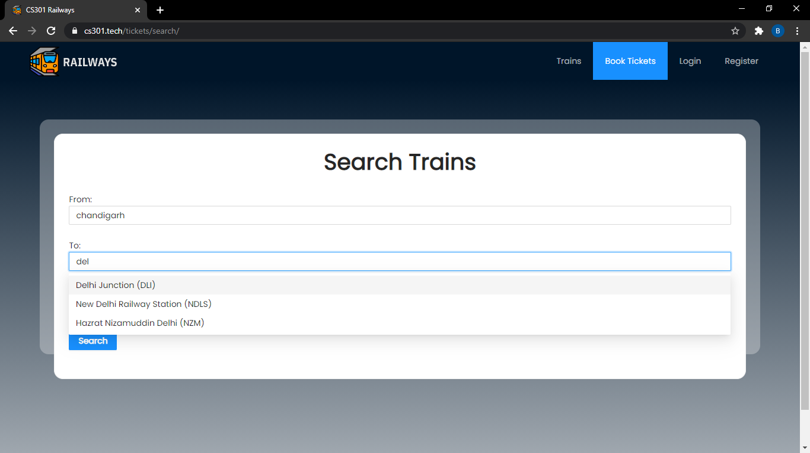
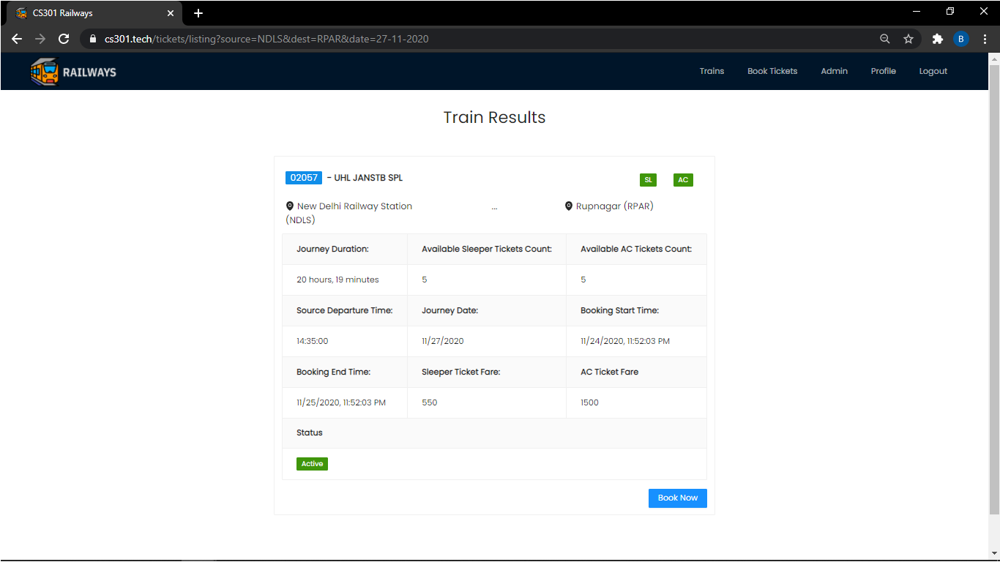
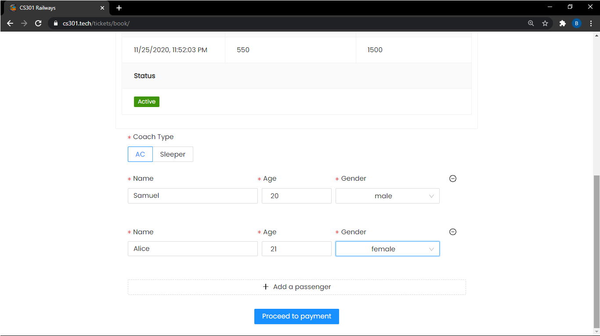
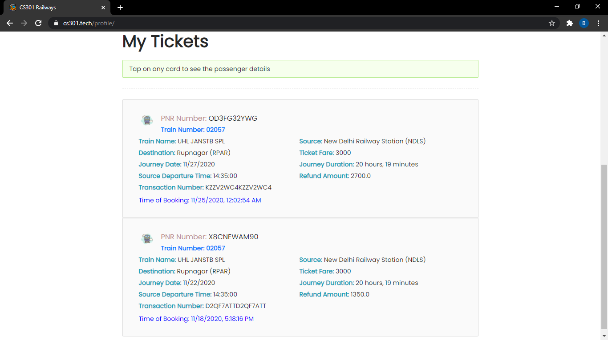
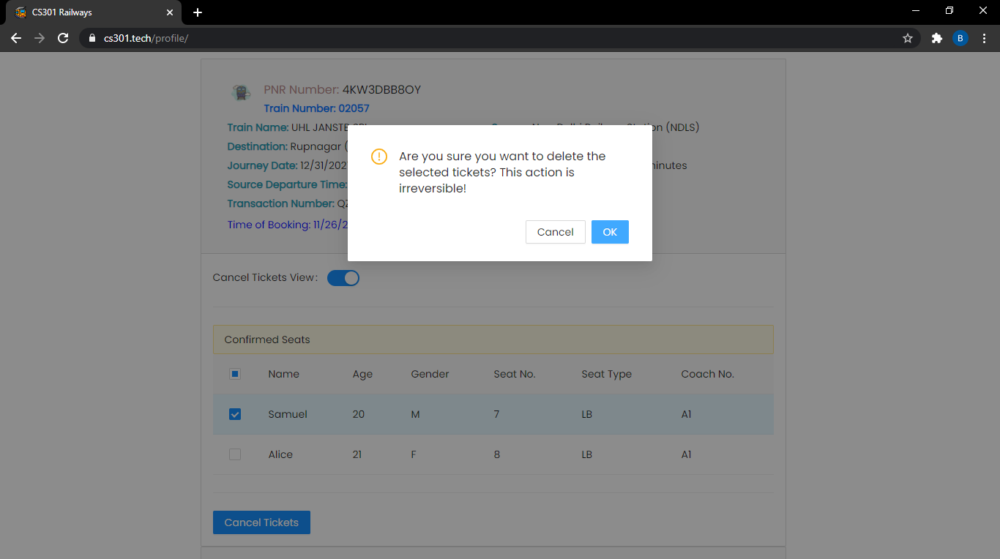
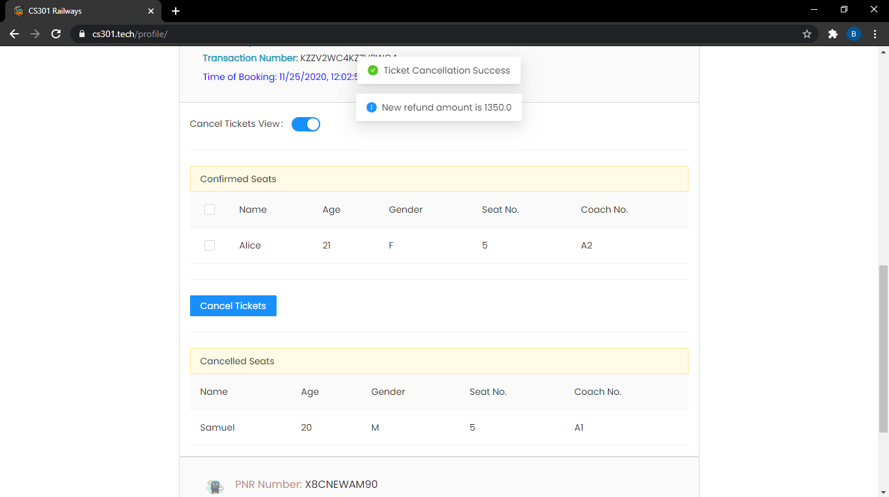

# Railways

The following website is a Railway Ticket Booking Portal. This project embraces the Client-Server architecture, where the server and database are hosted separately and the client communicates via REST APIs. 

The latest version of the **Railway Reservation System** is deployed at **[traintkt.herokuapp.com](https://traintkt.herokuapp.com/)**.


## Project Design Overview



## ER Diagram


*Note: All blue and bolded attributes are primary key. All attributes with ? is indicating that the field can be NULL. Relations having [X] are dynamically created where X is some variable.*

<hr/>

<!-- Home Page  -->


## Key Features

1. The project uses dynamic SQL techniques, procedures, triggers, for consistency, and faster query execution. 

2. Client can browse though the trains catalogue, their details and all active booking instances of it.

3. The project implements an easy to use trains search view with autosuggestions for train stations. Client can enter source, destination and date of journey and find if there are any trains available for following parameters.

4. Both booking tickets and cancel tickets operation can be performed on multiple passengers at once. 

5. Admin can add trains, coaches, and booking instances from the 
user interface and need not write any SQL query.

6. Our portal supports multiple coaches, and the Admin can define which coach schema to choose at the time of adding a booking instance.

## Technology Stack
1. TypeScript
2. ReactJS (Frontend)
3. NodeJS (Backend)
4. PostgreSQL (Database)

## Functionalities Of Our Project
Use cases have been divided based on the end user i.e. Admin and Booking Agents.
    
### Functionalites for Admin
1. Separate Authentication for Admin, and a dedicated admin dashboard.
   
2. Admin can add new `Trains`, `Coaches` with different seating schemas into the database for the dashboard.

3. Add and update `Reservation status` for trains.

4. Admin can perform the above operations without writing any database query by using our **simple and convenient User Interface**.

### Demo
1. Trains list View
    
    <!-- Trains page view -->
    


2. Trains Search Route can help users quickly find the available trains based on starting location, ending location, and the journey date. To ease searching for a specific station, **we autocomplete the source and destination fields based on the keywords** entered by users with the possible stations.
   
    <!-- Search trains page view -->
    
    <br><br>
    <!-- Search results -->
    

3. Tickets Booking View
   
    <!-- Ticket booking input view -->
    

4. User Profile Dashboard showing all past tickets
    
    <!-- Ticket booking input view -->
    


5. Users can cancel the confirmed tickets before the train departure. This operation releases the seat for other passengers for booking while the train's booking status is "Active". The refund of the cancelation of tickets will be resolved every day during maintainance hours, this reegular update reduces the storage overhead, by releasing the details of refunds.
   
    <!-- cancel ticket view on profile -->
    
    <br><br>
    <!-- refund on ticket view on profile -->
    


## API Endpoints Overview

`POST user/profile` → Gives back information of the user; Only the authenticated user can see his data

`GET trains/list` → shows a list of all available trains; Public View

`GET trains/info/:id` → shows train information, and all bookings available; Public View

`GET /trains/current/active` → Shows all trains which are active booking phase; Public View

`GET /cities/all` → Returns a list of all cities which are either source or destination; Public View.

`POST tickets/book` → Allows user to book a ticket; Must be authenticated

`POST tickets/cancel` → Route to cancel berths from tickets; Must be authenticated; Can cancel only his/her ticket

`GET tickets/info/:pnr` → Gives back passenger list, and other info; Must be authenticated

`GET tickets/all/` → Gives back tickets for a user; Must be authenticated

`GET /coaches/list` → See all coaches; Public View;

`GET /coaches/:id` → Coach Information; Public View

`POST admin/addbookinginstance` → Add a train for booking; Must be an admin

`POST admin/trains/add` → Add a new train; Must be an admin

`POST admin/coaches/add` → Add a coach; Must be an admin;

`GET chart/:train_number/:date` → See the reservation chart; Public View

## Google Cloud Deployment

1. Build the frontend. Ensure that `.env` is updated with the correct server URL.  
```bash
cd frontend/
npm run build
```
2. Run the following command to build the server code.
```bash
cd server/
npm run build
```
3. Now copy the `build/` directory from `frontend/` to `server/dist/`.
```bash
cp frontend/build/ server/dist/build/ 
```
4. Add `app.yaml` inside `server/` with the following content. Replace `[DATA]` with correct value.
```yaml
runtime: nodejs12
instance_class: [DATA]

env_variables:
  DATABASE_URL : [DATA]
  SESSION_SECRET : [DATA]
  CLIENT_URL : [DATA]
  NODE_ENV: production

automatic_scaling:
  max_instances: [DATA]


handlers:
  - url: /api/.*
    secure: always
    script: auto
  # Serve all static files with url ending with a file extension
  - url: /(.*\..+)$
    secure: always
    static_files: dist/build/\1
    upload: dist/build/(.*\..+)$
  # Catch all handler to index.html
  - url: /.*
    secure: always
    static_files: dist/build/index.html
    upload: dist/build/index.html

```
5. Now add `.gcloudignore` file inside `server/` and add the following content.
```
node_modules/
src/
.env
.prettierrc.json
.prettierignore
tsconfig.json
```
6. Deploy the project to app engine.
```bash
gcloud app deploy
```